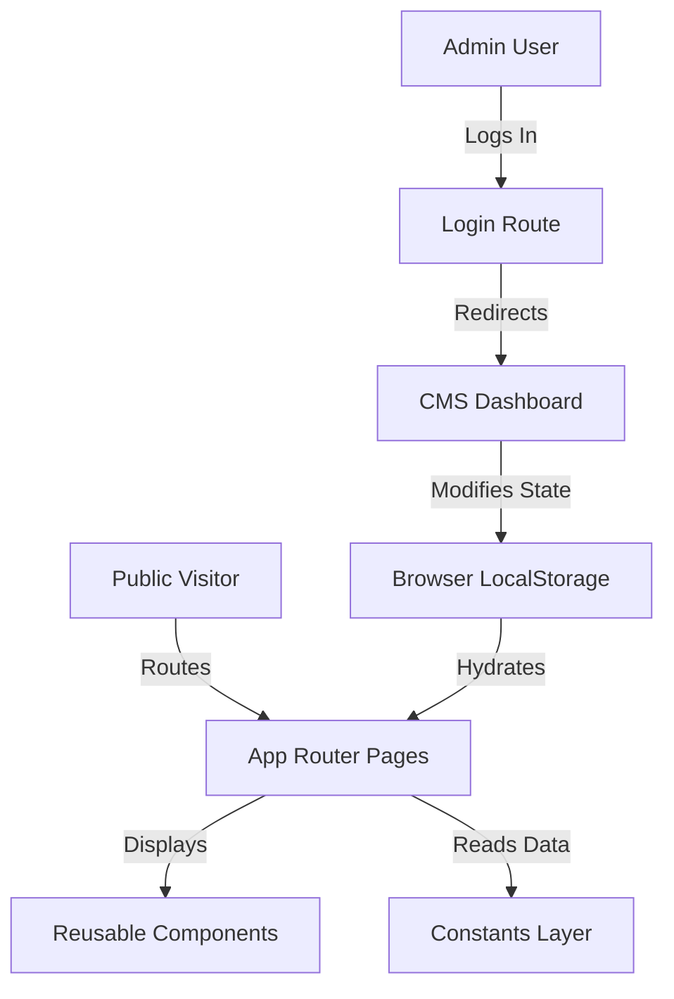

# Centre for Peace Praxis

A modern, production-ready web application for the **Centre for Peace Praxis** at CHRIST (Deemed to be University), refactored from a legacy multi-page HTML/CSS website into a high-performance Next.js application using React 19, TypeScript, and Tailwind CSS v4.

---

## Overview

The **Centre for Peace Praxis** is an academic and community hub established on August 16, 2023, at CHRIST (Deemed to be University). Its main purpose is to build communities of hope, healing, and resilience through peace literacy, psychosocial support, intercultural dialogue, and ecological well-being.

This application serves as:
1. **Public Portal**: Showcases the Centre's core pillars, upcoming/completed activities, orientation programs, faculties, student coordinator groups, alumni, and photographic galleries.
2. **Interactive Site Builder**: Provides an administrative CMS Dashboard that empowers site admins to edit home page copy, banners, statistics, and events in real time.
3. **Peace Initiative Directory**: Features detailed reports on academic colloquiums (e.g. *Changing Rains*), guest lectures (*Role of Religious Leaders*), workshops (*Bridging Hearts*), and disability panels (*Dares You to Be Different*).

---

## Features

- **Dynamic Homepage**: Features dynamically rendered statistics, core pillars, "Christites for Peace" volunteer highlights, and interactive banners.
- **Chronological Event Timeline**: Lists and automatically sorts upcoming events based on structured date objects.
- **Activity Report Engine**: Dynamic sub-routing (`/workshops/[slug]`) generating media-rich activity logs, panelist bios, key takeaways, and gallery lightboxes.
- **Interactive Image Lightbox**: A custom, zero-dependency photo preview modal for event snaps.
- **Admin CMS Dashboard**: An editing interface with simulated live-updating preview mode (Desktop/Mobile responsive frame toggles) allowing text and status customization.
- **Local Storage Content Persistence**: Preserves administrator changes in browser storage, ensuring mock edits are saved locally without backend database setup.
- **Custom UI Library**: Tailored, reusable UI elements (Button, Card, Modal, Toast) conforming to the primary brand styling.

---

## Tech Stack

| Layer | Technology | Description |
| --- | --- | --- |
| **Frontend Core** | Next.js 16.2.7 (App Router) | React Framework with Server/Client component routing |
| **Language** | TypeScript ^5.0 | Strong static typing for robust application flow |
| **Styling Engine** | Tailwind CSS ^4.0 | Utility-first styling with modern PostCSS nesting and variables |
| **Icons Library** | Lucide React | Visual iconography for menus, badges, and status elements |
| **Content State** | LocalStorage API | Handles client-side CMS adjustments and mock session management |
| **Build Tooling** | Turbopack / Next CLI | Modern, fast developer builds and compilations |

---

## Architecture

The project is built on Next.js **App Router** guidelines with a strict separation of components, static constants, page routes, and TypeScript type interfaces.



- **Data Hydration**: The app uses client-side state hydration in `page.tsx` and `dashboard/page.tsx` to read from the LocalStorage cache. If empty, the system automatically imports and caches default content schemas.
- **Authentication Flow**: Mock login logic validates `admin / admin` credentials client-side and sets an authentication token inside the browser session.

---

## Project Structure

```text
CPP/
├── archive/                       # Archive of legacy HTML/CSS pages
├── public/                        # Static assets directory
│   └── assets/                    # Speaker photos, posters, and logos
└── src/
    ├── app/                       # App Router paths & routes
    │   ├── about/                 # About Page route
    │   ├── community/             # Faculty, Student, and Alumni listings
    │   │   ├── alumni/
    │   │   ├── faculties/
    │   │   └── students/
    │   ├── dashboard/             # Admin CMS Site Builder Dashboard
    │   ├── directors-note/        # Director's Note page
    │   ├── gallery/               # Gallery & Lightbox component page
    │   ├── login/                 # Administrator portal access page
    │   ├── workshops/             # Dynamic activity directories & reports
    │   │   ├── [slug]/
    │   │   └── page.tsx
    │   ├── globals.css            # Tailwind CSS v4 variables & custom animations
    │   ├── layout.tsx             # Document wrapper, fonts, and meta headers
    │   └── page.tsx               # Main public homepage (hydrated CMS)
    ├── components/                # Modular React component library
    │   ├── layout/                # Global layout elements (Header, Footer)
    │   └── ui/                    # Reusable atom elements (Button, Card, Modal, Toast)
    ├── constants/                 # Structured database-like raw data
    │   ├── community.ts           # Faculty and student web developer records
    │   ├── gallery.ts             # Lightbox assets and alt attributes
    │   └── workshops.ts           # Structured Activity entries, speakers, and takeaways
    └── types/                     # Shared TypeScript interfaces
        └── index.ts
```

---

## Installation

### Prerequisites
Make sure you have Node.js (version 18.x or above) and npm installed.

### Setup Steps
1. Clone the repository to your local drive.
2. Navigate to the project root directory:
   ```bash
   cd CPP
   ```
3. Install the dependencies:
   ```bash
   npm install
   ```

---

## Running Locally

To run the Next.js development server:
```bash
npm run dev
```

Open [http://localhost:3000](http://localhost:3000) with your browser to view the application in action.

---

## Build Process

To compile a highly optimized, production-ready static export bundle:

```bash
npm run build
```

This compiles TypeScript, checks for lint rules, bundles resources, and saves the output in the `.next/` directory.

To preview the production build locally:
```bash
npm run start
```

---

## Environment Variables

This project does not require an active backend database or external cloud client services, so no `.env` files are required. All configuration, layouts, and edits persist locally within browser storage.

---

## Database & Persistence Schema

In the absence of a SQL/NoSQL engine, state schema is defined as flat JSON keys in `src/app/page.tsx`.

### Core Properties in CMS State
| Key | Data Type | Default Value | Description |
| --- | --- | --- | --- |
| `heroTitle` | `string` | "Centre for Peace Praxis" | Main welcome heading |
| `heroDesc` | `string` | "Building communities of hope..." | Supporting mission statement |
| `stat1Value` | `string` | "20+" | Completed activities count |
| `stat1Label` | `string` | "Activities Conducted" | Activity counter label |
| `whyTitle` | `string` | "Why Centre for Peace Praxis?" | Section subtitle |

---

## User Roles & Permissions

1. **Guest User**: Granted read-only permission across the public portal. Can view all activity listings, reports, and community tables.
2. **Administrator**: Can access `/dashboard` by logging in with `admin / admin`. Has write access to edit page content, layout properties, and verify styles under a live desktop/mobile preview simulator.

---

## Dependencies

- **lucide-react** (`^1.17.0`): Supplies modern, vector icon templates used in lists, tabs, buttons, and alert modules.
- **eslint-config-next** (`16.2.7`): Asserts best practices, prevents common Next.js bugs, and checks code style during compilation.
- **@tailwindcss/postcss** (`^4`): Powers postprocessing styles to enable custom design themes using modern variables inside `globals.css`.

---

## Performance Optimizations

1. **Next.js Font Loader**: Uses Google Fonts (`Cormorant Garamond`, `Montserrat`, `Open Sans`) preloaded via Next.js configurations to eliminate layout shifts (CLS).
2. **Turbopack Engine**: Configured to enable rapid hot module reloading (HMR) and optimized fast refreshing in dev mode.
3. **Modular CSS Variables**: Global colors are mapped directly to design tokens in Tailwind v4 `@theme` layers, preventing redundant stylesheet parsing.

---

## Known Limitations

- **State Persistence**: Custom changes made inside the Dashboard are local to the client's current browser and will not sync across other users' devices.
- **Image Optimization Warns**: Standard HTML `` elements are used to dynamically support image-swaps on static local structures, bypassing Next.js `<Image>` loader requirements to maintain fast client-side rendering.

---

## License

This project is licensed under the terms of CHRIST (Deemed to be University). All rights reserved.
